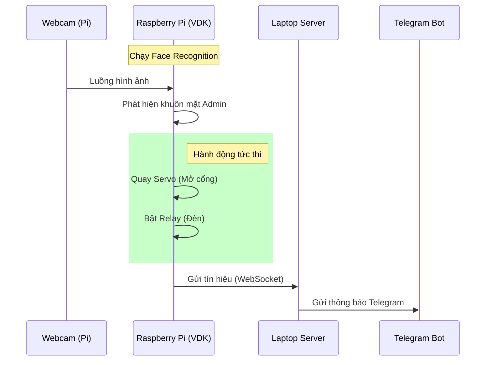

# Quy trình vận hành Hệ thống VDK

Tài liệu này mô tả kịch bản tự động hóa: Nhận diện khuôn mặt trên Raspberry Pi -> Gửi thông báo qua Server Laptop -> Điều khiển thiết bị ngoại vi.

---

## 🔄 1. Sơ đồ luồng xử lý (Workflow)



---

## 🛠️ 2. Các bước triển khai

### Bước 1: Xử lý trên Raspberry Pi (Edge)
- **Nhận diện**: Sử dụng thư viện `face_recognition` để xác thực Admin.
- **Kích hoạt phần cứng**: Gọi các hàm điều khiển GPIO trong [Hướng dẫn Phần cứng](./hardware_setup_guide.md).
- **Gửi dữ liệu**: Gửi JSON lên Server qua WebSocket.

### Bước 2: Xử lý trên Laptop (Server)
- **Tiếp nhận**: Lắng nghe sự kiện từ Pi.
- **Thông báo**: Gọi API Telegram để thông báo.

---

## 📂 3. Cấu trúc mã nguồn đề xuất

### Trên Raspberry Pi (`start_pi.py`):
```python
def process_frame(frame):
    if is_admin(frame):
        # 1. Điều khiển phần cứng
        open_gate()    
        turn_on_light() 
        
        # 2. Báo cáo về Server
        send_to_server({"event": "admin_detected"})
```

### Trên Laptop (`server.py`):
```python
async def on_pi_message(data):
    if data["event"] == "admin_detected":
        await telegram_bot.send_message("🔓 Đã mở cửa cho Admin!")
```

---

## 🔗 Liên kết liên quan
- [Hướng dẫn Nhận diện khuôn mặt](./face_recognition_guide.md)
- [Hướng dẫn Điều khiển Phần cứng](./hardware_setup_guide.md)
- [Cài đặt Raspberry Pi](./raspberry_pi_setup_guide.md)
